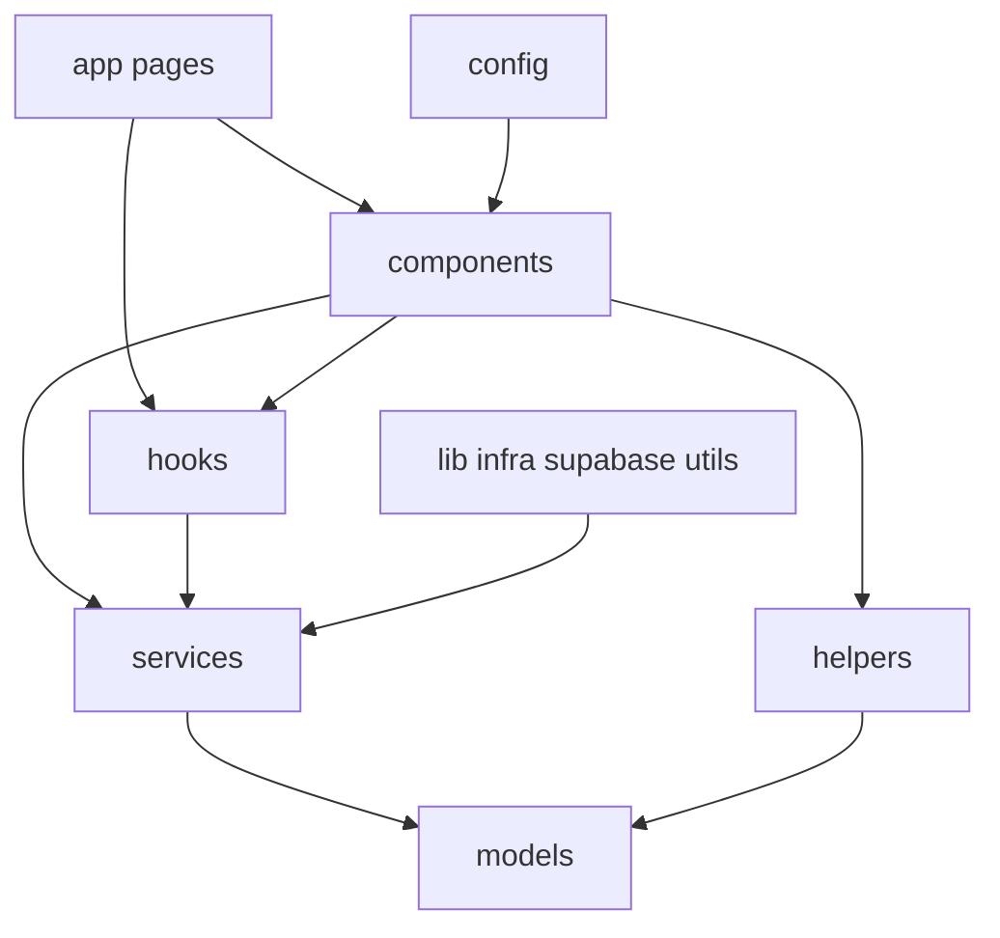

# Plan — 01-restructura-carpetas

## Cómo se crea esta carpeta de implementación

Seguir la guía en [`implementaciones/README.md`](../README.md):

- Nombre `NN-slug-corto` (ej. `01-restructura-carpetas`).
- Siempre incluir `datos-generales.md`, `plan.md` y `recursos/`.

## Recursos de apoyo (detalle operativo)

Todo el detalle de estructura, nombres y movimientos está en [`recursos/`](./recursos/):

| Archivo | Contenido |
|---|---|
| [`estructura-carpetas.md`](./recursos/estructura-carpetas.md) | Before/after de `src/` y responsabilidades por capa |
| [`nomenclaturas.md`](./recursos/nomenclaturas.md) | Reglas de nombres (models, services, helpers, etc.) |
| [`mapa-movimientos.md`](./recursos/mapa-movimientos.md) | De → a de archivos e imports |
| [`snippets-mapa.md`](./recursos/snippets-mapa.md) | Organización de `supabase/snippets` |
| [`huerfanos.md`](./recursos/huerfanos.md) | Limpieza de archivos sin uso |

---

# Restructura de carpetas + historial de implementaciones

## Regla: historial en `implementaciones/`

En la **raíz del repo** existe `implementaciones/` como bitácora de cambios grandes.

Convención (documentada en `implementaciones/README.md`):

```text
implementaciones/
  README.md                          # cómo crear subcarpetas (la guía)
  01-restructura-carpetas/
    datos-generales.md               # nombre, fecha, objetivo, estado
    plan.md                          # este archivo: plan completo
    recursos/
      estructura-carpetas.md
      nomenclaturas.md
      mapa-movimientos.md
      ...
```

Reglas de naming de subcarpetas: `NN-slug-corto` (dos dígitos, kebab-case).

---

## Decisiones fijadas

- **Capas top-level en `src/`**: `helpers/`, `config/`, `services/`, `models/`.
- **Alcance completa**: lib → capas + unificar components + partir interfaces a models (definición real por archivo) + ordenar `supabase/snippets` + limpiar huérfanos.
- **No tocar** estructura/rutas de `src/app` (solo actualizar imports dentro de pages si un módulo se mueve).
- **No tocar** `supabase/migrations`, `seed.sql`, ni config inmutable de Supabase.
- **Nombres de interfaces se mantienen** (`bandaInterface`, `bandaDatosAmpleosInterface`, etc.); solo se redistribuyen por carpeta/archivo con el **cuerpo real** en cada archivo (no stubs ni monolito `allInterfaces`).

---

## Estructura objetivo de `src/`

Ver también [`recursos/estructura-carpetas.md`](./recursos/estructura-carpetas.md).

```text
src/
  app/                 # INTANGIBLE (rutas/pages)
  components/          # único hogar UI (dominio + shadcn)
    ui/
    shadcn-studio/
    bandas/, eventos/, ...
  models/              # interfaces estilo repository
    bandas/
      bandaInterface.ts              # definición real
      bandaDatosAmpleosInterface.ts  # definición real + imports
    categorias/
    eventos/
    auditoria/
    index.ts           # único barrel raíz (reexporta archivos reales)
  services/
    servidor/
  helpers/
  config/
  actions/
  lib/                 # infra mínima
  hooks/
  store/
  features/
  providers/
  types/
  animacionesJson/
```



---

## 1. Unificar `component` + `components`

- Mover todo `src/component/` hacia `src/components/`, conservando `ui/` y `shadcn-studio/`.
- Actualizar imports `@/component/...` → `@/components/...`.
- Mantener alias de `components.json`.

## 2. Partir interfaces → `models/` (estilo repository)

- Un archivo por interface/type, con la **definición completa** (`export interface` / `export type`).
- Carpeta por dominio; nombre de archivo = nombre del export.
- Si A depende de B, A importa desde la ruta real de B.
- Un solo `src/models/index.ts` raíz que reexporta desde los archivos reales (para que `from "@/models"` siga funcionando).
- **Prohibido**: monolito `allInterfaces.ts` y stubs `export type { X } from "../allInterfaces"`.

Dominios: `bandas`, `categorias`, `roles`, `criterios`, `cumplimientos`, `federaciones`, `penalizaciones`, `perfiles`, `regiones`, `eventos`, `rubricas`, `resultados`, `solicitudes`, `copas`, `sanciones`, `asistencia`, `checkout`, `auditoria`, etc.

## 3. Desarmar `lib/` en capas

| Origen actual | Destino |
|---|---|
| `lib/services/**` | `src/services/**` |
| helpers de dominio (`fechas`, `busqueda`, `errores`, …) | `src/helpers/**` |
| `navegacion`, `rutas`, `atajos` | `src/config/**` |
| `lib/actions/**` | `src/actions/**` |
| `supabase*.ts`, `utils.ts`, `*Persistence.ts` | permanece en `src/lib/` |

Detalle: [`recursos/mapa-movimientos.md`](./recursos/mapa-movimientos.md).

## 4. Renombres de consistencia

- `src/feacture/` → `src/features/`
- `src/Store/` → `src/store/`

## 5. `supabase/snippets` (solo organización)

- No tocar `migrations/`.
- Mover SQL sueltos a subcarpetas temáticas.
- Detalle: [`recursos/snippets-mapa.md`](./recursos/snippets-mapa.md).

## 6. Huérfanos / sin propósito

- Scripts y schema sin uso; basura en `tsconfig` include.
- Detalle: [`recursos/huerfanos.md`](./recursos/huerfanos.md).

## 7. Estrategia de imports

1. Mover archivo (preferir `git mv`).
2. Actualizar todas las referencias.
3. Verificar que no queden imports rotos.
4. No cambiar lógica de negocio.

Orden de ejecución:

1. Docs de historial (`implementaciones/`).
2. Models reales.
3. Capas lib → services/helpers/config/actions.
4. Unificar components.
5. Renombrar features/store.
6. Snippets + huérfanos.
7. Verificación final.

---

## Fuera de alcance

- Refactors de lógica o renombrar interfaces.
- Rediseño visual o cambios de comportamiento.
- Reorganizar rutas/páginas bajo `src/app`.
- Alterar migraciones de Supabase.
